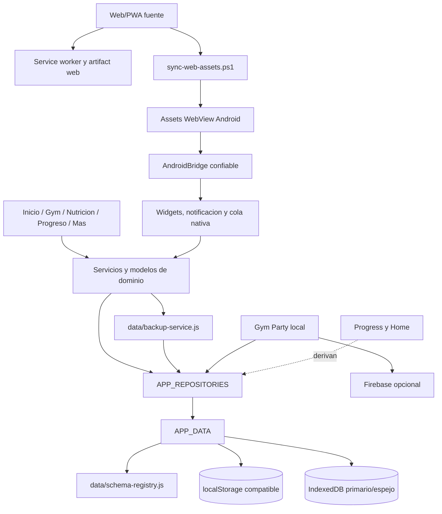

# Arquitectura del producto

Este documento describe ownership y limites actuales. Las versiones y canales
se consultan en `app-version.json` y `.github/stable-release.json`; no se fijan
aqui.

## Vista general

## Dominios y propietarios

| Area | Propietario principal | Responsabilidad | No posee |
|---|---|---|---|
| Shell y Protocolo diario | `index.html`, `app/home-state.js` | Registro diario, score, composicion de vistas | Historial de Workout |
| Home Gym-first | `app/gym-home-state.js`, `app/gym-home-controller.js` | Proyectar el estado Gym y enrutar CTA | Crear o persistir sesiones |
| Gym / Workout | `workout-features.js`, `workout-store.js`, `workout-plan.js`, `gym/` | Rutina, sesiones, series, importacion nativa y reglas de entrenamiento | Progreso como store separado |
| Progreso | `progress/` | Derivar metricas de registros existentes | Persistencia canonica propia |
| Nutricion | `nutrition/`, `fdc-client.js` | Entradas, metas, recetas, porciones, busqueda y cache | Secretos de proveedor en backup |
| Gym Party local | `gym-party.js`, `gym-party-sync.js` | Sala, cola, privacidad, proyeccion compartida y reconciliacion | Sustituir `workoutSessions` |
| Firebase | `firebase-service.js`, `firebase/` | Backend opcional, autenticacion, reglas y colecciones compartidas | Ser requisito para el uso local |
| Datos | `data/schema-registry.js`, `data/indexeddb.js`, `data/repositories.js` | Registrar, validar, leer, escribir, espejar, recuperar y poner en cuarentena | Logica de presentacion |
| Backup | `data/backup-service.js` | Exportar, previsualizar, fusionar/reemplazar y deshacer por dominio | Definir claves fuera del registro |
| PWA | `sw.js`, `precache-manifest.js`, scripts de build | Cache atomica, offline y artifacts coherentes | Cambiar datos de dominio |
| Android wrapper | `android-native-wrapper/app/src/main/` | WebView seguro, bridges, widgets, notificacion y cola durable | Reimplementar el producto Web |
| Release | `.github/workflows/`, `scripts/release-identity.mjs` | Quality gate, firma, artifacts y promociones separadas | Inferir Stable desde `main` |

## Dependencias permitidas

1. Las vistas llaman modelos/servicios de su dominio y repositorios publicos.
2. Los repositorios delegan en `APP_DATA`; `APP_DATA` valida contra el registro.
3. Home y Progreso leen datos canonicos y producen modelos derivados sin
   convertirlos en stores nuevos.
4. Gym Party puede leer Workout para compartir una proyeccion autorizada; una
   reconciliacion remota termina en el mismo `workoutSessions` canonico.
5. El wrapper Android intercambia contratos versionados con Web. La deteccion de
   APK exige el bridge confiable; Web/PWA no simulan capacidades nativas.
6. El arbol Web de la raiz es fuente. Los assets Android son una copia generada
   y verificada por hash.

## Persistencia

`data/schema-registry.js` registra todas las claves Web estructuradas. `APP_DATA`
usa localStorage como formato compatible/write-ahead y puede promover grupos a
IndexedDB. El registro decide elegibilidad, retencion, backup y redaccion. Los
repositorios agrupan acceso por dominio.

Existen fallbacks directos a localStorage y constantes repetidas por
compatibilidad. Tambien existe `protocolo_0_100_state_v2`, un agregado derivado
para compatibilidad/sync. Ninguno de esos casos es una segunda fuente canonica;
su reduccion gradual esta en `docs/technical-debt-register.md`.

## Web, PWA y Android

- Web y PWA ejecutan el mismo core de la raiz.
- PWA agrega manifest, service worker, cache versionada y soporte offline.
- Android carga los assets mediante `WebViewAssetLoader` sobre HTTPS local,
  restringe navegacion y expone bridges nativos.
- SharedPreferences nativas conservan estado de widget/controles y mutaciones
  schema 1 hasta que el importador idempotente las aplica a Workout.
- `scripts/sync-web-assets.ps1` es el unico mecanismo para actualizar la copia
  WebView.

## Pipeline de release

PR y `main` ejecutan `.github/workflows/validate-app.yml`, que reutiliza un unico
`quality-gate.yml`. Android release es manual, firmado e inmutable. Pages Stable
solo avanza cuando cambia `.github/stable-release.json` y pasa el guard de
alineacion. Los dos canales tienen SHAs administrativos potencialmente distintos
sin que eso implique dos versiones funcionales.

## Limites actuales

Los archivos globales cargados por orden, los tres orquestadores grandes y los
accesos directos de compatibilidad son arquitectura actual, no el objetivo final.
No deben ampliarse por conveniencia. Toda mejora se realiza por PR acotado y se
registra antes en el inventario de deuda.
